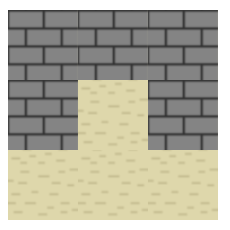
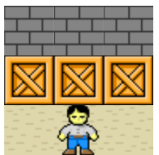
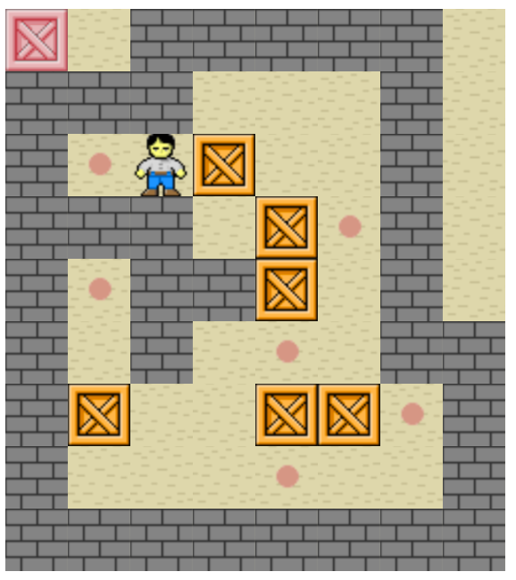

# Sokoban+

A JavaScript project walk-through for novice programmers.

In this project you will make a game called Sokoban+. [Check it out](https://mikegagnon.github.io/sokoban/).

## Prerequisites

Mastery of [Lights Out](https://github.com/mikegagnon/lights-out/blob/master/README.md),
[Thumb Wrestling](https://github.com/mikegagnon/thumb-wrestling/blob/master/README.md), and
recursion (see [linked lists](https://github.com/mikegagnon/linked-lists/blob/master/README.md) and
[binary search trees](https://github.com/mikegagnon/bst/blob/master/README.md)).
And familiarity with OOP (object-orient programming) in JavaScript.

## Contents

- [Part 1. Introduction & Setup](#part1)
    - [Lecture 1.1 Modular design](#lec1-1)
    - [Lecture 1.2 The `Snapshot` class](#lec1-2)
- [Part 2. The `Sokoban` class](#part2)
    - [Challenge 2.1 A player among empty squares](#c2-1)
    - [Lecture 2.2 Isomorphisms](#lec2-2)
    - [Challenge 2.3 Refactor the `Sokoban` class with an isomorphism](#c2-3)
    - [Lecture 2.4 Modify `Sokoban` so that is uses a `Board` object instead of a `Snapshot` object](#lec2-4)
    - [Challenge 2.5 Prevent out-of-bounds movement](#c2-5)
    - [Challenge 2.6 Sliders](#c2-6)
    - [Challenge 2.7 Detect victory](#c2-7)
- [Part 3. The `Viz` class](#part3)
- [Part 4. Putting it all together](#part4)

# <a name="part1">Part 1. Introduction & Setup</a>

## <a name="lec1-1">Lecture 1.1 Modular design</a>

I regret to report that in Lights Out and Thumb wrestling, our code was a jumbled mess of spaghetti code.

In this project, we'll develop better code by using better design. Specifically, we'll be using modular
design which includes OOP.

In modular design we divide the program into different modules (classes in OOP).

### MVC

A classic example of modular design is MVC (model, view, controller). With regards to Sokoban+:

- The *model* module encapsulates all game logic for Sokoban+
- The *view* module visualizes the game state (by drawing it on the webpage)
- The *controller* module receives input from the player

### Implementing MVC

Implementing our MVC design into code, we have:

- The `Sokoban` class, which implements all game logic
- The `Viz` class, which draws the game state on the webpage
- The `keydown` function, which receives input from the player

### Interfaces for modules

For the game to work as a whole, the modules must connect with each other somehow.
We want these connections to be "thin interfaces."

An *interface* to a module is the opening into the module by which it receives
input and delivers output.

For example, the interface to the [`Queue` class](https://github.com/mikegagnon/dlists/blob/master/README.md#lec13)
is *thin*: there are only two methods.

- There is an `enqueue(...)` method which puts data into the queue, and
- There is a `dequeue(...)` method which retrieves data from the queue

An important principle of modular design is that thin interfaces hide complexity.
In this case, clients of the `Queue` class don't need to know anything about how the `Queue` class is implemented.
They don't need to know about `Node` objects, nor `prev` references, etc. They just need to know
`enqueue(...)` and `dequeue(...)`.

### Interfaces for Sokoban+

The `Sokoban` class has a thin interface: there are only two methods.

```js
class Sokoban {

    // The snapshot argument defines the initial gamestate
    constructor(snapshot) {...}
    
    // Moves the player in the specified direction. direction must be either:
    // "up", "down", "left", or "right"
    // Returns a snapshot object that defines the game state after the player is moved
    move(direction) {...}
}
```

The `Viz` class has a thin interface: there are only two methods.

```js
class Viz {
    
    // The boardId argument specifies the HTML id for the <div> element that will
    // hold the game board
    //
    // The snapshot argument defines the initial gamestate
    constructor(boardId, snapshot) {...}
    
    // The snapshot argument defines the game state that is to be drawn on the web page
    drawGame(snapshot) {...}
}
```

The `keydown` function is therefore simple:

```js
// SOKOBAN is a reference to an instance of the Sokoban class
// VIZ is a reference to an instance of the Viz class
function keydown(event) {

    var direction = // the direction of the arrow key that was pressed

    var snapshot = SOKOBAN.move(direction);
    VIZ.drawGame(snapshot);
}
```

`snapshot` objects are defined by the `Snapshot` class:

```js
// pieceId values
var EMPTY = 0;
var BLOCK = 1;
var SLIDER = 2;
var PLAYER = 3;
var GOAL = 4;
var GOAL_SLIDER = 5;
var GOAL_PLAYER = 6;

/* Snapshot class *************************************************************/
class Snapshot {

    // The matrix argument is a 2-dimensional array describing board state.
    // Each item in the matrix is a pieceId. Namely, either EMPTY, BLOCK,
    // SLIDER, PLAYER, GOAL, GOAL_SLIDER, GOAL_PLAYER.
    //
    // The gameOver argument is a boolen that is true iff the player has solved
    // the puzzle.
    constructor(matrix, gameOver) {
        this.matrix = matrix;
        this.gameOver = gameOver;
        this.numRows = matrix.length;
        this.numCols = matrix[0].length;
    }
}
```

Hopefully it is clear that the `Snapshot` class is the keystone that glues 
together the interfaces between all modules for Sokoban+.

### Benefits of modular design

#### Parallel development

If we had two developers building Sokoban+ at the same time,
one developer could build the `Sokoban` class, while at the same time the other 
developer could build the `Viz` class (independently). 

#### Manage complexity

If the vizualization code were interwoven with the game logic code (i.e. non modular design),
the code would be more complex, more difficult to read, reason about, test, etc.

#### Forgetting code

Once an interface is created, you can safely forget its implementation.

For example, you could implement `Sokoban` before implementing `Viz`. Then, you
could forget all the complexities of how `Sokoban` is implemented, and
code `Viz`, since `Viz` and `Sokoban` interact over a thin interface.

Forgetting code is nice, because it's impossible to remember
all the code in a large enough system.

#### Refactoring modules

Refactoring essentially means reimplementing. Imagine
a software system with 10 modules, connected via various thin interfaces.
You could easily refactor one module (say, to make it more efficient),
without touching any other module.

Without modular design, you would have a bunch of spaghetti code
and you would have to refactor the whole thing.

#### And more

...

### Art

Modular design is more of an art than a science. It takes lots of experience to be able to design good interfaces.

When I worked at Twitter, at the beginning of a project our team would get together and brainstorm.
Then the senior engineer on the team would declare what modules we would build and the interfaces 
between these modules. Then we'd adjourn the meeting, and all the junior engineers would 
implement the modules in parallel, over a period of about a month, and we'd stitch the modules
together as we finished each module.

## <a name="lec1-2">Lecture 1.2 The `Snapshot` class</a>

Recall from the Introduction, `snapshot` objects are defined by the `Snapshot` class:

```js
// pieceId values
var EMPTY = 0;
var BLOCK = 1;
var SLIDER = 2;
var PLAYER = 3;
var GOAL = 4;
var GOAL_SLIDER = 5;
var GOAL_PLAYER = 6;

/* Snapshot class *************************************************************/
class Snapshot {

    // The matrix argument is a 2-dimensional array describing board state.
    // Each item in the matrix is a pieceId. Namely, either EMPTY, BLOCK,
    // SLIDER, PLAYER, GOAL, GOAL_SLIDER, GOAL_PLAYER.
    //
    // The gameOver argument is a boolen that is true iff the player has solved
    // the puzzle.
    constructor(matrix, gameOver) {
        this.matrix = matrix;
        this.gameOver = gameOver;
        this.numRows = matrix.length;
        this.numCols = matrix[0].length;
    }
}
```

To help understand the exact usage of this class, here are some examples.

### Example 1



```js
// Recall:
//    EMPTY == 0
//    BLOCK == 1

var matrix =  [
   [1, 1, 1],
   [1, 0, 1],
   [0, 0, 0]
];

var gameOver = false;

var snapshot = new Snapshot(matrix, gameOver);

VIZ = new Viz("#board", snapshot);
```

### Example 2



```js
// Recall:
//    SLIDER == 2
//    PLAYER == 3

var matrix =  [
    [1, 1, 1],
    [2, 2, 2],
    [0, 3, 0]
];

var gameOver = false;

var snapshot = new Snapshot(matrix, gameOver);

VIZ = new Viz("#board", snapshot);
```

### Example 3



```js

// Recall:
//    EMPTY == 0
//    BLOCK == 1
//    SLIDER == 2
//    PLAYER == 3
//    GOAL == 4
//    GOAL_SLIDER == 5
//    GOAL_PLAYER == 6

var matrix =  [
    [5, 0, 1, 1, 1, 1, 1, 0],
    [1, 1, 1, 0, 0, 0, 1, 0],
    [1, 4, 3, 2, 0, 0, 1, 0],
    [1, 1, 1, 0, 2, 4, 1, 0],
    [1, 4, 1, 1, 2, 0, 1, 0],
    [1, 0, 1, 0, 4, 0, 1, 1],
    [1, 2, 0, 0, 2, 2, 4, 1],
    [1, 0, 0, 0, 4, 0, 0, 1],
    [1, 1, 1, 1, 1, 1, 1, 1]
];

var gameOver = false;

var snapshot = new Snapshot(matrix, gameOver);

VIZ = new Viz("#board", snapshot);
```

### Tests for the `Snapshot` class

```js
function assert(condition) {
    if (!condition) {
        console.error("Test failed");
    }
}

/******************************************************************************/
/* Snapshot tests *************************************************************/
/******************************************************************************/

var matrix = [
    [0, 0, 0],
    [0, 0, 0],
    [0, 0, 0],
];
var gameOver = false;
var snapshot = new Snapshot(matrix, gameOver);
assert(snapshot.matrix == matrix);
assert(snapshot.gameOver == gameOver);
assert(snapshot.numRows == 3);
assert(snapshot.numCols == 3);

var matrix = [
    [0, 0, 0],
    [0, 0, 0],
];
var gameOver = true;
var snapshot = new Snapshot(matrix, gameOver);
assert(snapshot.matrix == matrix);
assert(snapshot.gameOver == gameOver);
assert(snapshot.numRows == 2);
assert(snapshot.numCols == 3);

var matrix = [
    [0, 0],
    [0, 0],
    [0, 0],
];
var gameOver = true;
var snapshot = new Snapshot(matrix, gameOver);
assert(snapshot.matrix == matrix);
assert(snapshot.gameOver == gameOver);
assert(snapshot.numRows == 3);
assert(snapshot.numCols == 2);

```

# <a name="part2">Part 2. The `Sokoban` class</a>

Since `Sokoban` and `Viz` are independent modules, we can implement them in any order.
Skip to [The `Viz` class](#part3) if you feel like it.

However, I recommend starting with `Sokoban` and finishing with `Viz`.
This way, you can experience the magic of developing a complete video game
without graphics. Then, after completing the game, you stitch in some graphics and
viola --- the game comes to life and works perfectly.

## Template for project

First:

- Put together an `index.html` file that imports `sokoban.js`.
- Add the `Snapshot` class and the *pieceId* values to `sokoban.js`.
- Add the shell for the `Sokoban` class.

### `sokoban.js`

```js
// pieceId values
var EMPTY = 0;
var BLOCK = 1;
var SLIDER = 2;
var PLAYER = 3;
var GOAL = 4;
var GOAL_SLIDER = 5;
var GOAL_PLAYER = 6;

/* Snapshot class *************************************************************/
class Snapshot {

    // The matrix argument is a 2-dimensional array describing board state.
    // Each item in the matrix is a pieceId. Namely, either EMPTY, BLOCK,
    // SLIDER, PLAYER, GOAL, GOAL_SLIDER, GOAL_PLAYER.
    //
    // The gameOver argument is a boolen that is true iff the player has solved
    // the puzzle.
    constructor(matrix, gameOver) {
        this.matrix = matrix;
        this.gameOver = gameOver;
        this.numRows = matrix.length;
        this.numCols = matrix[0].length;
    }
}

/* Sokoban class **************************************************************/
class Sokoban {

    // The snapshot argument defines the initial gamestate
    constructor(snapshot) {
        // To be implemented...
    }

    // Moves the player in the specified direction. direction must be either:
    // "up", "down", "left", or "right"
    // Returns a snapshot object that defines the game state after the player is moved
    move(direction) {
        // To be implemented...
    }
}

```


## <a name="c2-1">Challenge 2.1 A player among empty squares</a>

We will implement `move(...)`, but only for the case where:

- The player's movement stays in bounds
- The incoming `snapshot` contains only `EMPTY` cells and one `PLAYER` cell

### Write tests first

In divergence from previous projects, we will write our tests first, and our code second.

Before writing our tests we implement a helper function `snapshots_equal(...)`
that compares two snapshots and returns true iff the snapshots are identical. The helper function
`snapshots_equal(...)` depends on another helper method `matrices_equal(...)` that checks
two matrices for equality.

```js
// Returns true iff the two snapshots are identical
function snapshots_equal(snapshot1, snapshot2) {
    return matrices_equal(snapshot1.matrix, snapshot2.matrix) &&
        snapshot1.gameOver == snapshot2.gameOver &&
        snapshot1.numRows == snapshot2.numRows &&
        snapshot1.numCols == snapshot2.numCols;
}

// Returns true iff matrix1 and matrix2 have the same dimensions and values
function matrices_equal(matrix1, matrix2) {

    var numRows1 = matrix1.length;
    var numCols1 = matrix1[0].length;

    var numRows2 = matrix2.length;
    var numCols2 = matrix2[0].length;

    if (numRows1 != numRows2 || numCols1 != numCols2) {
        return false;
    }

    for (var row = 0; row < numRows1; row++) {
        for (var col = 0; col < numCols1; col++) {
            if (matrix1[row][col] != matrix2[row][col]) {
                return false;
            }
        }
    }

    return true;
}
```

Having implemented `snapshots_equal(...)`, we next write
four tests for the `Sokoban(...)` class: one for each direction (up, down, left, right).

```js

/* Test case: only in bounds. Only empty squares and player *******************/

// Init sokoban
var matrix = [
    [0, 0],
    [0, 3],
    [0, 0],
];

var snapshot_init = new Snapshot(matrix, false);
var sokoban = new Sokoban(snapshot_init);


// Test move up
var snapshot_result = sokoban.move("up");
var matrix_expected = [
    [0, 3],
    [0, 0],
    [0, 0],
];
var snapshot_expected = new Snapshot(matrix_expected, false);
assert(snapshots_equal(snapshot_result, snapshot_expected));

// Test move left
var snapshot_result = sokoban.move("left");
var matrix_expected = [
    [3, 0],
    [0, 0],
    [0, 0],
];
var snapshot_expected = new Snapshot(matrix_expected, false);
assert(snapshots_equal(snapshot_result, snapshot_expected));

// Test move down
var snapshot_result = sokoban.move("down");
var matrix_expected = [
    [0, 0],
    [3, 0],
    [0, 0],
];
var snapshot_expected = new Snapshot(matrix_expected, false);
assert(snapshots_equal(snapshot_result, snapshot_expected));

// Test move right
var snapshot_result = sokoban.move("right");
var matrix_expected = [
    [0, 0],
    [0, 3],
    [0, 0],
];
var snapshot_expected = new Snapshot(matrix_expected, false);
assert(snapshots_equal(snapshot_result, snapshot_expected));


```

### Challenge: implement `move(...)` such that the four tests pass

- [Hint 1](#hint2-1-1)
- [Hint 2](#hint2-1-2)
- [Hint 3](#hint2-1-3)
- [Hint 4](#hint2-1-4)
- [Hint 5](#hint2-1-5)
- [Hint 6](#hint2-1-6)
- [Solution](#solution2-1)

## <a name="lec2-2">Lecture 2.2 Isomorphisms</a>

First, an example:

### Example of an isomorphism

There are letters (the alphabet of letters is *L*),
and there are morse-code sounds (the alphabet of sounds is *M*).

Every letter *l* in *L* can be converted to a sound *m* in *M*.

And every sound *m* in *M* can be converted to a sound *l* in *L*.

The two-way mapping between *L* and *M* is an "isomorphism between *L* and *M*."

### Definition of "isomorphism"

In JavaScript, an isomorphism is a class that relates two datatypes, say *A* and *B*. Every isomorphism
class has two static functions: `toB(...)` and `toA(...)`.

```js
class IsoAB {

    // converts an instance of datatype A to an instance of datatype B
    static toB(a) {...}
    
    // converts an instance of datatype B to an instance of datatype A
    static toA(b) {...}
}
```

For every element `a` of `A`: `btoa(atob(a))` must equal `a`.

And:

For every element `b` of `B`: `atob(btoa(b))` must equal `b`.

### Example

```js
class IsoLetterMorse {

    static toMorse(letter) {
        if (letter == "a") {
            return ".-";
        } else if (letter == "b") {
            return "-...";
        } 
            ...
    }
    
    static toLetter(morse) {
        if (morse == ".-") {
            return "a";
        } else if (morse == "-...") {
            return "b";
        }
            ...
    }
}
```

### A prophecy

One day, you will be in a conference room surrounded by your peers.
The Senior Software Engineer on the team sits at the head of the 
conference table. An engineer from another continent is on video chat.

Everyone is trying to figure out how to solve this one particular problem...

Suddenly you have a flashback to this course. You say, "We could use
an isomorphism. It will preserve our existing interfaces. We can avoid
a major version change."

Silence. Someone nods. Slowly, everyone nods.

Then suddenly the Senior Software Engineer asserts,
"No, it won't work for this problem. The isomorphism would be prohibitively slow."

And so it's back to the drawing board. But at least you looked intelligent.


## <a name="c2-3">Challenge 2.3 Develop the Sokoban isomorphisms</a>

In this challenge we will develop:

1. a `Board` class that is isomorphic with the `Snapshot` class
2. a `Cell` class that is isomorphic with `pieceId` values
3. an `IsoSnapshotBoard` isomorphism (for converting between the
  `Board` and `Snapshot` classes)
3. an `IsoPieceidCell` isomorphism (for converting between the `Cell` class
  and `pieceId` values)

In the next lecture ([Lecture 2.4](#lec2-4)), we will refactor the `Sokoban`
class using the above isomorphisms as our basis.

### Contents of this challenge

This section contains many subsections, and may be a bit unwieldy. To help make
it more wieldy, here are the subsections of this section:

- [`Board` and `Cell` class definitions](#c2-3-board-cell-def)
- [Outline of the `IsoSnapshotBoard` isomorphism](#c2-3-IsoSnapshotBoard-outline)
- [Outline of the `IsoPieceidCell` isomorphism](#c2-3-IsoPieceidCell-outline")
- [The challenge](#c2-3-challege)
- [Tests for `IsoPieceidCell`](#c2-3-tests-for-IsoPieceidCell)
- [Tests for `IsoSnapshotBoard`](#c2-3-tests-for-IsoSnapshotBoard)

### <a name="c2-3-board-cell-def">`Board` and `Cell` class definitions</a>

The `Board` class is like the `Snapshot` class, except the `Board` class stores
the game state is a matrix of `Cell` objects, whereas the `Snapshot` class
stores the game state in a matrix of `pieceId` values.

```js
/* Board class ****************************************************************/
class Board {

    // The cells argument is a 2-dimensional matrix describing the board state.
    // Each item in cells is a cell object, which is to say an instance of the
    // Cell class.
    //
    // The gameOver argument is a boolen that is true iff the player has solved
    // the puzzle.
    constructor(cells, gameOver) {
        this.cells = cells;
        this.gameOver = gameOver;
        this.numRows = cells.length;
        this.numCols = cells[0].length;
    }
}

/* Cell class *****************************************************************/
// Iff this.block == true, then that means there is a block in this cell
// And so on for this.slider, this.player, and this.goal
class Cell {
    constructor(block, slider, player, goal) {
        this.block = block;
        this.slider = slider;
        this.player = player;
        this.goal = goal;
    }
}
```

### <a name="c2-3-IsoSnapshotBoard-outline">Outline of `IsoSnapshotBoard` isomorphism</a>

```js
/* IsoSnapshotBoard class *****************************************************/
class IsoSnapshotBoard {

    // Converts a Snapshot object to a Board objeect
    static toBoard(snapshot) { ... }

    // Converts a Board object to a Snapshot object
    static toSnapshot(board) { ... }
}
```

### <a name="c2-3-IsoPieceidCell-outline">Outline of `IsoPieceidCell` isomorphism</a>

```js
/* IsoPieceidCell class *****************************************************/
class IsoPieceidCell {

    // Converts a pieceId value to a Cell objeect
    static toCell(pieceId) { ... }

    // Converts a Cell object to a pieceId value
    static toPieceId(cell) { ... }
}
```

### <a name="c2-3-challege">The challenge</a>

Implement `IsoSnapshotBoard` and `IsoPieceidCell`.

#### Hints for `IsoPieceidCell`

- No hints for `IsoPieceidCell`
- [Solution for `IsoPieceidCell`](#solution-IsoPieceidCell)

#### Hints for `IsoSnapshotBoard`

- [Hint 1](#hint2-3-1)
- [Solution for `IsoSnapshotBoard`](#solution-IsoSnapshotBoard)

#### <a name="c2-3-tests-for-IsoPieceidCell">Tests for `IsoPieceidCell`</a>

```js
/* Tests for IsoPieceidCell  **************************************************/

// Returns true iff cell1 and cell2 are identical
function cells_equal(cell1, cell2) {
    return cell1.block == cell2.block &&
        cell1.slider == cell2.slider &&
        cell1.player == cell2.player &&
        cell1.goal == cell2.goal;
}

// Test toCell
var cell1 = IsoPieceidCell.toCell(EMPTY);
var cell2 = new Cell(false, false, false, false);
assert(cells_equal(cell1, cell2));

var cell1 = IsoPieceidCell.toCell(BLOCK);
var cell2 = new Cell(true, false, false, false);
assert(cells_equal(cell1, cell2));

var cell1 = IsoPieceidCell.toCell(SLIDER);
var cell2 = new Cell(false, true, false, false);
assert(cells_equal(cell1, cell2));

var cell1 = IsoPieceidCell.toCell(PLAYER);
var cell2 = new Cell(false, false, true, false);
assert(cells_equal(cell1, cell2));

var cell1 = IsoPieceidCell.toCell(GOAL);
var cell2 = new Cell(false, false, false, true);
assert(cells_equal(cell1, cell2));

var cell1 = IsoPieceidCell.toCell(GOAL_SLIDER);
var cell2 = new Cell(false, true, false, true);
assert(cells_equal(cell1, cell2));

var cell1 = IsoPieceidCell.toCell(GOAL_PLAYER);
var cell2 = new Cell(false, false, true, true);
assert(cells_equal(cell1, cell2));

// Test toPieceid
var emptyCell = new Cell(false, false, false, false);
var pieceId = IsoPieceidCell.toPieceid(emptyCell)
assert(pieceId == EMPTY);

var blockCell = new Cell(true, false, false, false);
var pieceId = IsoPieceidCell.toPieceid(blockCell)
assert(pieceId == BLOCK);

var sliderCell = new Cell(false, true, false, false);
var pieceId = IsoPieceidCell.toPieceid(sliderCell)
assert(pieceId == SLIDER);

var playerCell = new Cell(false, false, true, false);
var pieceId = IsoPieceidCell.toPieceid(playerCell)
assert(pieceId == PLAYER);

var goalCell = new Cell(false, false, false, true);
var pieceId = IsoPieceidCell.toPieceid(goalCell)
assert(pieceId == GOAL);

var goalSliderCell = new Cell(false, true, false, true);
var pieceId = IsoPieceidCell.toPieceid(goalSliderCell)
assert(pieceId == GOAL_SLIDER);

var goalPlayerCell = new Cell(false, false, true, true);
var pieceId = IsoPieceidCell.toPieceid(goalPlayerCell)
assert(pieceId == GOAL_PLAYER);
```

#### <a name="c2-3-tests-for-IsoSnapshotBoard">Tests for `IsoSnapshotBoard`</a>

```js

function test_IsoSnapshotBoard(snapshot1) {
    var board1 = IsoSnapshotBoard.toBoard(snapshot1);
    var snapshot2 = IsoSnapshotBoard.toSnapshot(board1);
    var board2 = IsoSnapshotBoard.toBoard(snapshot2);
    
    assert(snapshots_equal(snapshot1, snapshot2));
    assert(boards_equal(board1, board2));
}

function boards_equal(board1, board2) {
    if (board1.gameOver != board2.gameOver ||
        board1.numRows != board2.numRows ||
        board1.numCols != board2.numCols) {
        return false;
    }

    for (var row = 0; row < board1.numRows; row++) {
        for (var col = 0; col < board1.numCols; col++) {
            var cell1 = board1.cells[row][col];
            var cell2 = board2.cells[row][col];
            if (!cells_equal(cell1, cell2)) {
                return false;
            }
        }
    }

    return true;
}

// gameOver false
var matrix = [[EMPTY]];
var gameOver = false;
var snapshot = new Snapshot(matrix, gameOver);
test_IsoSnapshotBoard(snapshot);

// gameOver true
var matrix = [[EMPTY]];
var gameOver = true;
var snapshot = new Snapshot(matrix, gameOver);
test_IsoSnapshotBoard(snapshot);

// SLIDER
var matrix = [[SLIDER]];
var gameOver = false;
var snapshot = new Snapshot(matrix, gameOver);
test_IsoSnapshotBoard(snapshot);

// PLAYER
var matrix = [[PLAYER]];
var gameOver = false;
var snapshot = new Snapshot(matrix, gameOver);
test_IsoSnapshotBoard(snapshot);

// GOAL
var matrix = [[GOAL]];
var gameOver = false;
var snapshot = new Snapshot(matrix, gameOver);
test_IsoSnapshotBoard(snapshot);

// GOAL_SLIDER
var matrix = [[GOAL_SLIDER]];
var gameOver = false;
var snapshot = new Snapshot(matrix, gameOver);
test_IsoSnapshotBoard(snapshot);

// GOAL_PLAYER
var matrix = [[GOAL_PLAYER]];
var gameOver = false;
var snapshot = new Snapshot(matrix, gameOver);
test_IsoSnapshotBoard(snapshot);

// Complex matrix
var matrix =  [
    [5, 0, 1, 1, 1, 1, 1, 0],
    [1, 1, 1, 0, 0, 0, 1, 0],
    [1, 4, 3, 2, 0, 0, 1, 0],
    [1, 1, 1, 0, 2, 4, 1, 0],
    [1, 4, 1, 1, 2, 0, 1, 0],
    [1, 0, 1, 0, 4, 0, 1, 1],
    [1, 2, 0, 0, 2, 2, 4, 1],
    [1, 0, 0, 0, 4, 0, 0, 1],
    [1, 1, 1, 1, 1, 1, 1, 1]
];
var gameOver = false;
var snapshot = new Snapshot(matrix, gameOver);
test_IsoSnapshotBoard(snapshot);

```


### <a name="lec2-4">Modify `Sokoban` so that is uses a `Board` object instead of a `Snapshot` object</a>

Make the following modifications:

```js
class Sokoban {

    // The snapshot argument defines the initial gamestate
    constructor(snapshot) {
        this.board = IsoSnapshotBoard.toBoard(snapshot); // <----------------------

        var [row, col] = this.findPlayer();
        this.playerRow = row;
        this.playerCol = col;
    }

    findPlayer() {

        for (var row = 0; row < this.board.numRows; row++) {       // <------------
            for (var col = 0; col < this.board.numCols; col++) {   // <------------
                var cell = this.board.cells[row][col];             // <------------
                if (cell.player) {                                 // <------------
                    return [row, col];
                }
            }
        }

        // If there is no player
        assert(false);
    }
    
    // Moves the player in the specified direction. direction must be either:
    // "up", "down", "left", or "right"
    // Returns a snapshot object that defines the game state after the player is moved
    move(direction) {

        this.board.cells[this.playerRow][this.playerCol].player = false; // <------------

        if (direction == "up") {
            this.playerRow -= 1;
        } else if (direction == "down") {
            this.playerRow += 1;
        } else if (direction == "left") {
            this.playerCol -= 1;
        } else if (direction == "right") {
            this.playerCol += 1;
        } else {
            assert(false);
        }

        this.board.cells[this.playerRow][this.playerCol].player = true; // <------------

        return IsoSnapshotBoard.toSnapshot(this.board);                 // <------------
    } 
}
```

Observe: the semantics of `move(...)` have changed slightly.

In the old version (from [Challenge 2.1](#c2-1)), `move(...)` only worked for matrices containing
only `EMPTY` and `PLAYER` pieceIds.

Now, it can also handle `GOAL_PLAYER` pieces too.

If it's not clear to you what's going on, study the `Cell` class (in contrast to `pieceId`) and study
the old and new `move(...)` methods.

### Tests for the new `move(...)` method

We can add several more tests for the `move(...)` method, now that it handles `GOAL_PLAYER` pieces:

```js
// Test exiting PLAYER exiting GOAL
var matrix = [
    [0, 0],
    [0, 6],
    [0, 0],
];

var snapshot_init = new Snapshot(matrix, false);
var sokoban = new Sokoban(snapshot_init);

var snapshot_result = sokoban.move("up");
var matrix_expected = [
    [0, 3],
    [0, 4],
    [0, 0],
];
var snapshot_expected = new Snapshot(matrix_expected, false);
assert(snapshots_equal(snapshot_result, snapshot_expected));

var snapshot_result = sokoban.move("down");
var matrix_expected = [
    [0, 0],
    [0, 6],
    [0, 0],
];
var snapshot_expected = new Snapshot(matrix_expected, false);
assert(snapshots_equal(snapshot_result, snapshot_expected));
```


## <a name="c2-5">Challenge 2.5 Prevent out-of-bounds movement</a>

The player should not be able to move out of bounds.

For example, if the player is in the left-most column, `move("left")` should
do nothing; it should have no effect on the game; the game state should not
change.

### Challenge

1. Modify the semantics of the `move(...)` function so that the player cannot
   go out of bounds
2. Write tests to verify / refute that the new `move(...)` function
   is implemented correctly

- [Hint 1](#hint2-5-1)
- [Hint 2](#hint2-5-2)
- [Hint 3](#hint2-5-3)
- [Solution](#solution2-5)


## <a name="c2-6">Challenge 2.6 Sliders</a>

In this challenge, we will implement the functionality that handles sliders.

Recall the semantics of the Sokoban+ game: if a player pushes into a series of 
sliders, then the player and all the sliders will all move together (assuming
there is a vacant space for them to move into).

We will write a recursive function called `push(...)` to handle player &
crate movement.

The idea is that the `move(...)` function calls `push`  on the player,
then the player calls `push` on the adjacent slider, then that slider
calls `push` onto the next slider, and so on... until the push
bumps into a block, out of bounds, or an empty space.


### `push(...)`

Here is the documentation for `push(...)`:

```js
// push(row, col, direction)
//
// Attempts to push the player or slider from (row, col) into 
// (newRow, newCol), where (newRow, newCol) is adjacent to (row, col) in
// the given direction. For example, if (row, col) == (0, 0), and
// direction == right, then (newRow, newCol) == (0, 1).
//
// If there is no player or slider at (row, col) --- say, because (row, col)
// is empty or occupied by a block --- then of course no movement attempt is
// made.
//
// The push attempt may or may not succeed. If the push attempt succeeds
// then the piece at (row, col) is moved into (newRow, newCol).
//
// Returns true iff (row, col) can be moved into by a slider or the player.
//      - For example, if (row, col) is empty, then returns true
//      - As another example, if (row, col) formerly held a slider, but
//        that slider has successefully been pushed into a new cell,
//        then (row, col) is now empty, and so returns true.
//
// Recall the semantics of the game: a player can push a series of sliders
// as long as the last slider in the series can slide into an empty cell.
// Therefore, this function must be recursive.
//
// For further clarification on the necessity of recursion, consider this
// example:
//
//      The player is located at (0, 0).
//      A slider is located at (0, 1), i.e. to the right of the player.
//
//      The player can only move to the right, iff the slider can 
//      move to the right.
//
//      Therefore push(0, 0, "right") depends on the result of of
//      push(0, 1, "right"), which depends on the result of
//      push(0, 2, "right").
//
// Don't bother attempting to implement push(...) until you understand
// the documentation for this function.
push(row, col, direction) { ... }
```

### Refactor `move(...)`

Once you have implemented `push(...)`, the `move(...)` function simply
becomes:

```js
// Moves the player in the specified direction. direction must be either:
// "up", "down", "left", or "right"
// Returns a snapshot object that defines the game state after the player is moved
move(direction) {
    this.push(this.playerRow, this.playerCol, direction);
    return IsoSnapshotBoard.toSnapshot(this.board);
}
```

### Tests

```js
/* Test push 1 crate inbounds *************************************************/

var matrix = [
    [0, 0],
    [2, 0],
    [3, 0],
];
var snapshot_init = new Snapshot(matrix, false);
var sokoban = new Sokoban(snapshot_init);
var snapshot_result = sokoban.move("up");
var matrix_expected = [
    [2, 0],
    [3, 0],
    [0, 0],
];
var snapshot_expected = new Snapshot(matrix_expected, false);
assert(snapshots_equal(snapshot_result, snapshot_expected));

/* Test push 2 crates inbounds *************************************************/

var matrix = [
    [0, 0],
    [2, 0],
    [2, 0],
    [3, 0],
];
var snapshot_init = new Snapshot(matrix, false);
var sokoban = new Sokoban(snapshot_init);
var snapshot_result = sokoban.move("up");
var matrix_expected = [
    [2, 0],
    [2, 0],
    [3, 0],
    [0, 0],
];
var snapshot_expected = new Snapshot(matrix_expected, false);
assert(snapshots_equal(snapshot_result, snapshot_expected));

/* Test push 1 crate over goal ************************************************/

var matrix = [
    [0, 4],
    [4, 0],
    [2, 0],
    [3, 0],
];
var snapshot_init = new Snapshot(matrix, false);
var sokoban = new Sokoban(snapshot_init);
var snapshot_result = sokoban.move("up");
var matrix_expected = [
    [0, 4],
    [5, 0],
    [3, 0],
    [0, 0],
];
var snapshot_expected = new Snapshot(matrix_expected, false);
assert(snapshots_equal(snapshot_result, snapshot_expected));

/* Test push player and crate over goal ****************************************/

var matrix = [
    [0, 0],
    [4, 0],
    [5, 0],
    [3, 0],
];
var snapshot_init = new Snapshot(matrix, false);
var sokoban = new Sokoban(snapshot_init);
var snapshot_result = sokoban.move("up");
var matrix_expected = [
    [0, 0],
    [5, 0],
    [6, 0],
    [0, 0],
];
var snapshot_expected = new Snapshot(matrix_expected, false);
assert(snapshots_equal(snapshot_result, snapshot_expected));

/* Test push crate out of bounds **********************************************/

var matrix = [
    [2, 0],
    [2, 0],
    [3, 0],
    [0, 0],
];
var snapshot_init = new Snapshot(matrix, false);
var sokoban = new Sokoban(snapshot_init);
var snapshot_result = sokoban.move("up");
var matrix_expected = [
    [2, 0],
    [2, 0],
    [3, 0],
    [0, 0],
];
var snapshot_expected = new Snapshot(matrix_expected, false);
assert(snapshots_equal(snapshot_result, snapshot_expected));

/* Test push crate into block *************************************************/

var matrix = [
    [0, 0],
    [1, 0],
    [2, 0],
    [3, 0],
];
var snapshot_init = new Snapshot(matrix, false);
var sokoban = new Sokoban(snapshot_init);
var snapshot_result = sokoban.move("up");
var matrix_expected = [
    [0, 0],
    [1, 0],
    [2, 0],
    [3, 0],
];
var snapshot_expected = new Snapshot(matrix_expected, false);
assert(snapshots_equal(snapshot_result, snapshot_expected));
```


### Hints and solution

- [Hint 1](#hint2-6-1)
- [Hint 2](#hint2-6-2)
- [Hint 3](#hint2-6-3)
- [Solution](#solution2-6)


## <a name="c2-7">Challenge 2.7 Detect victory</a>

Write a method `checkVictory()` that returns `true` iff victory has been
achieved. Victory is achieved when every goal is covered by a slider.
In the corner case where there are no goals, then victory has not been
achieved.

Update the `move(...)` function as follows:

```js
// Moves the player in the specified direction. direction must be either:
// "up", "down", "left", or "right"
// Returns a snapshot object that defines the game state after the player is moved
move(direction) {

    if (this.board.gameOver) {
        return IsoSnapshotBoard.toSnapshot(this.board); 
    }

    this.push(this.playerRow, this.playerCol, direction);

    this.board.gameOver = this.checkForVictory();

    return IsoSnapshotBoard.toSnapshot(this.board);
}
```

- [Hint 1](#hint2-7-1)
- [Solution](#solution2-7)


# <a name="part3">Part 3. The `Viz` class</a>

# <a name="part4">Part 4. Putting it all together</a>


# Hints

<br><br><br><br><br><br><br><br><br><br><br><br><br><br><br><br><br><br><br><br><br>

## <a name="hint2-1-1">Hint 1 for Challenge 2.1</a>

Implement a method in the Sokoban class called `findPlayer()` that returns
the row and column of the player in a `snapshot`.

[Back to challenge](#c2-1)

<br><br><br><br><br><br><br><br><br><br><br><br><br><br><br><br><br><br><br><br><br>

## <a name="hint2-1-2">Hint 2 for Challenge 2.1</a>

The `findPlayer()` function should iterate over every cell in the `snapshot` (using `for` loops)
until it finds the player.

[Back to challenge](#c2-1)


<br><br><br><br><br><br><br><br><br><br><br><br><br><br><br><br><br><br><br><br><br>

## <a name="hint2-1-3">Hint 3 for Challenge 2.1</a>

Here is a `static` implementation of `findPlayer()`:

```js
class Sokoban {
    
    ...

    static findPlayer(snapshot) {
        for (var row = 0; row < snapshot.numRows; row++) {
            for (var col = 0; col < snapshot.numCols; col++) {
                var pieceId = snapshot.matrix[row][col];
                if (pieceId == PLAYER) {
                    return [row, col];
                }
            }
        }

        // If there is no player
        assert(false);
    }
}
```

[Back to challenge](#c2-1)

<br><br><br><br><br><br><br><br><br><br><br><br><br><br><br><br><br><br><br><br><br>

## <a name="hint2-1-4">Hint 4 for Challenge 2.1</a>

Implement the `Sokoban` `constructor` as so:

```js
class Sokoban {

    ...
    
    constructor(snapshot) {
        this.snapshot = snapshot;
        var [row, col] = Sokoban.findPlayer(snapshot);
        this.playerRow = row;
        this.playerCol = col;
    }
    
    ...
}
```

[Back to challenge](#c2-1)

<br><br><br><br><br><br><br><br><br><br><br><br><br><br><br><br><br><br><br><br><br>

## <a name="hint2-1-5">Hint 5 for Challenge 2.1</a>

The `move(...)` function needs to perform the following operations:

1. On the board, set the old position of the player to EMPTY
2. Compute the new position of the player
3. On the board, set the new position of the player to PLAYER
4. Return the snapshot


[Back to challenge](#c2-1)

<br><br><br><br><br><br><br><br><br><br><br><br><br><br><br><br><br><br><br><br><br>

## <a name="hint2-1-6">Hint 6 for Challenge 2.1</a>

Implement the `Sokoban` `move(...)` method as so:

```js
class Sokoban {

    ...

    // Moves the player in the specified direction. direction must be either:
    // "up", "down", "left", or "right"
    // Returns a snapshot object that defines the game state after the player is moved
    move(direction) {

        this.snapshot.matrix[this.playerRow][this.playerCol] = EMPTY;

        if (direction == "up") {
            this.playerRow -= 1;
        } else if (direction == "down") {
            this.playerRow += 1;
        } else if (direction == "left") {
            this.playerCol -= 1;
        } else if (direction == "right") {
            this.playerCol += 1;
        } else {
            assert(false);
        }

        this.snapshot.matrix[this.playerRow][this.playerCol] = PLAYER;

        return this.snapshot;
    }
}
```


[Back to challenge](#c2-1)

<br><br><br><br><br><br><br><br><br><br><br><br><br><br><br><br><br><br><br><br><br>

## <a name="solution2-1">Solution for Challenge 2.1</a>

```js
/* Sokoban class **************************************************************/
class Sokoban {

    /* Static functions *******************************************************/
    static findPlayer(snapshot) {
        for (var row = 0; row < snapshot.numRows; row++) {
            for (var col = 0; col < snapshot.numCols; col++) {
                var pieceId = snapshot.matrix[row][col];
                if (pieceId == PLAYER) {
                    return [row, col];
                }
            }
        }

        // If there is no player
        assert(false);
    }

    /* Instance methods *******************************************************/

    // The snapshot argument defines the initial gamestate
    constructor(snapshot) {
        this.snapshot = snapshot;
        var [row, col] = Sokoban.findPlayer(snapshot);
        this.playerRow = row;
        this.playerCol = col;
    }

    // Moves the player in the specified direction. direction must be either:
    // "up", "down", "left", or "right"
    // Returns a snapshot object that defines the game state after the player is moved
    move(direction) {

        this.snapshot.matrix[this.playerRow][this.playerCol] = EMPTY;

        if (direction == "up") {
            this.playerRow -= 1;
        } else if (direction == "down") {
            this.playerRow += 1;
        } else if (direction == "left") {
            this.playerCol -= 1;
        } else if (direction == "right") {
            this.playerCol += 1;
        } else {
            assert(false);
        }

        this.snapshot.matrix[this.playerRow][this.playerCol] = PLAYER;

        return this.snapshot;
    }
}
```


[Back to challenge](#c2-1)

<br><br><br><br><br><br><br><br><br><br><br><br><br><br><br><br><br><br><br><br><br>

## <a name="solution-IsoPieceidCell-">Solution for Challenge 2.3, `IsoPieceidCell`</a>

```js
class IsoPieceidCell {

    static toCell(pieceId) {

        var block = false;
        var slider = false;
        var player = false;
        var goal = false;

        if (pieceId == BLOCK) {
            block = true;
        } else if (pieceId == SLIDER) {
            slider = true;
        } else if (pieceId == PLAYER) {
            player = true;
        } else if (pieceId == GOAL) {
            goal = true;
        } else if (pieceId == GOAL_SLIDER) {
            goal = true;
            slider = true;
        } else if (pieceId == GOAL_PLAYER) {
            goal = true;
            player = true;
        }

        return new Cell(block, slider, player, goal);
    }

    static toPieceid(cell) {
        if (cell.block) {
            return BLOCK;
        } else if (cell.goal) {
            if (cell.slider) {
                return GOAL_SLIDER;
            } else if (cell.player) {
                return GOAL_PLAYER;
            } else {
                return GOAL;
            }
        } else if (cell.slider) {
            return SLIDER;
        } else if (cell.player) {
            return PLAYER;
        } else {
            return EMPTY;
        }
    }
}
```

<br><br><br><br><br><br><br><br><br><br><br><br><br><br><br><br><br><br><br><br><br>

## <a name="hint2-3-1">Hint 1 for Challenge 2.3</a>

### For `IsoSnapshotBoard.toBoard`

1. Create a new 2-D matrix and set `cells = \\ the new matrix`
2. Iterate over each `pieceId` value in `snapshot.matrix`, convert each `pieceId`
   value into a `Cell` object (using the `IsoPieceidCell` isomorphism),
   and save each new `Cell` object into the new `cells` matrix.
3. Return a new `Board` object that encapsulates `cells` and `snapshot.gameOver`

### For `IsoSnapshotBoard.toSnapshot`

Use a strategy similar to `IsoSnapshotBoard.toBoard` to perform the inverse of 
`IsoSnapshotBoard.toBoard`.

<br><br><br><br><br><br><br><br><br><br><br><br><br><br><br><br><br><br><br><br><br>

## <a name="solution-IsoSnapshotBoard">Solution for Challenge 2.3, `IsoSnapshotBoard`</a>

```js
class IsoSnapshotBoard {

    static newMatrix(numRows, numCols) {
        var matrix = new Array(numRows);
        for (var row = 0; row < numRows; row++) {
            matrix[row] = new Array(numCols);
        }
        return matrix;
    }

    static toBoard(snapshot) {

        var numRows = snapshot.numRows;
        var numCols = snapshot.numCols;

        var cells = IsoSnapshotBoard.newMatrix(numRows, numCols);

        for (var row = 0; row < numRows; row++) {
            for (var col = 0; col < numCols; col++) {
                var pieceId = snapshot.matrix[row][col];
                cells[row][col] = IsoPieceidCell.toCell(pieceId);
            }
        }

        return new Board(cells, snapshot.gameOver);
    }

    static toSnapshot(board) {
        var numRows = board.numRows;
        var numCols = board.numCols;

        var matrix = IsoSnapshotBoard.newMatrix(numRows, numCols);

        for (var row = 0; row < numRows; row++) {
            for (var col = 0; col < numCols; col++) {

                var cell = board.cells[row][col];
                matrix[row][col] = IsoPieceidCell.toPieceid(cell);
            }
        }

        return new Snapshot(matrix, board.gameOver);
    }
}
```

<br><br><br><br><br><br><br><br><br><br><br><br><br><br><br><br><br><br><br><br><br>

## <a name="hint2-5-1">Hint 1 for Challenge 2.5</a>

The `move` function should do the following:

- Check to see if prospective movement would put the player out of bounds
- If the movement would place the player out of bounds, then do not modify
  the game state; rather just return the snapshot
- If the movement is inbounds, thenL
    1. modify `board.cells` appropriately, and
    2. update `playerRow` and `playerCol`, and
    3. return a snapshot of the game state

<br><br><br><br><br><br><br><br><br><br><br><br><br><br><br><br><br><br><br><br><br>

## <a name="hint2-5-2">Hint 2 for Challenge 2.5</a>

To make your code elegant, implement an `inBounds(row, col)` function that
returns true iff (`row`, `col`) is inbounds.

<br><br><br><br><br><br><br><br><br><br><br><br><br><br><br><br><br><br><br><br><br>

## <a name="hint2-5-3">Hint 3 for Challenge 2.5</a>

You should write four tests:

1. Attempting to move up out of bounds
2. Attempting to move down out of bounds
3. Attempting to move left out of bounds
4. Attempting to move right out of bounds

<br><br><br><br><br><br><br><br><br><br><br><br><br><br><br><br><br><br><br><br><br>

## <a name="solution2-5">Solution for Challenge 2.5</a>

```js
/* Sokoban class **************************************************************/
class Sokoban {

    ...

    // Returns true iff (row, col) is in bounds
    inBounds(row, col) {
        return row >= 0 &&
               row < this.board.numRows &&
               col >= 0 &&
               col < this.board.numCols;
    }

    // Moves the player in the specified direction. direction must be either:
    // "up", "down", "left", or "right"
    // Returns a snapshot object that defines the game state after the player is moved
    move(direction) {

        var newRow = this.playerRow;
        var newCol = this.playerCol;

        if (direction == "up") {
            newRow -= 1;
        } else if (direction == "down") {
            newRow += 1;
        } else if (direction == "left") {
            newCol -= 1;
        } else if (direction == "right") {
            newCol += 1;
        } else {
            assert(false);
        }

        if (!this.inBounds(newRow, newCol)) {
            return IsoSnapshotBoard.toSnapshot(this.board);
        }

        this.board.cells[this.playerRow][this.playerCol].player = false;
        this.board.cells[newRow][newCol].player = true;

        this.playerRow = newRow;
        this.playerCol = newCol;

        return IsoSnapshotBoard.toSnapshot(this.board);
    }
}

// Test move out-of-bounds

// move right
var matrix = [
    [0, 3],
    [0, 0],
    [0, 0],
];
var snapshot_init = new Snapshot(matrix, false);
var sokoban = new Sokoban(snapshot_init);
var snapshot_result = sokoban.move("right");
var matrix_expected = [
    [0, 3],
    [0, 0],
    [0, 0],
];
var snapshot_expected = new Snapshot(matrix_expected, false);
assert(snapshots_equal(snapshot_result, snapshot_expected));

// move up
var matrix = [
    [0, 3],
    [0, 0],
    [0, 0],
];
var snapshot_init = new Snapshot(matrix, false);
var sokoban = new Sokoban(snapshot_init);
var snapshot_result = sokoban.move("up");
var matrix_expected = [
    [0, 3],
    [0, 0],
    [0, 0],
];
var snapshot_expected = new Snapshot(matrix_expected, false);
assert(snapshots_equal(snapshot_result, snapshot_expected));

// move down
var matrix = [
    [0, 0],
    [0, 0],
    [3, 0],
];
var snapshot_init = new Snapshot(matrix, false);
var sokoban = new Sokoban(snapshot_init);
var snapshot_result = sokoban.move("down");
var matrix_expected = [
    [0, 0],
    [0, 0],
    [3, 0],
];
var snapshot_expected = new Snapshot(matrix_expected, false);
assert(snapshots_equal(snapshot_result, snapshot_expected));

// move left
var matrix = [
    [0, 0],
    [0, 0],
    [3, 0],
];
var snapshot_init = new Snapshot(matrix, false);
var sokoban = new Sokoban(snapshot_init);
var snapshot_result = sokoban.move("left");
var matrix_expected = [
    [0, 0],
    [0, 0],
    [3, 0],
];
var snapshot_expected = new Snapshot(matrix_expected, false);
assert(snapshots_equal(snapshot_result, snapshot_expected));
```


<br><br><br><br><br><br><br><br><br><br><br><br><br><br><br><br><br><br><br><br><br>

## <a name="hint2-6-1">Hint 1 for Challenge 2.6</a>

TODO: link linked lists

Recall from the Linked Lists mini course:

- Step 1. Base case(s)
    - Analyze the corner cases
    - Merge cases
- Step 2. Recursive case
    - Assume correctness
    - Make one step of progress

<br><br><br><br><br><br><br><br><br><br><br><br><br><br><br><br><br><br><br><br><br>

## <a name="hint2-6-2">Hint 2 for Challenge 2.6</a>

There are three cases where there is no need for recursion. These are the base
cases:

1. When (row, col) is out of bounds 
2. When (row, col) contains a block
3. When (row, col) is either empty or contains only a goal

<br><br><br><br><br><br><br><br><br><br><br><br><br><br><br><br><br><br><br><br><br>

## <a name="hint2-6-3">Hint 3 for Challenge 2.6</a>

If it's not one of the base cases, then we know the cell is occupied by either
a slider, or a player.

Therefore, we make an attempt to move the slider or player.

We invoke `push(newRow, newCol, direction)` to determine if (`newRow`, `newCol`)
is available to be moved into.

If (`newRow`, `newCol`) is available, then we remove the slider or player
from its current cell, and place the slider or player into it's new cell at
(`newRow`, `newCol`).

If the movement succeeds, return `true` --- since (`row`, `col`) has been
vacated.

If the movement doesn't succeed, return `false` --- since (`row`, `col`) is
occupied.

<br><br><br><br><br><br><br><br><br><br><br><br><br><br><br><br><br><br><br><br><br>

## <a name="solution2-6">Solution for Challenge 2.6</a>

```js
class Sokoban {

    ...

    // push(row, col, direction)
    //
    // Attempts to push the player or slider from (row, col) into 
    // (newRow, newCol), where (newRow, newCol) is adjacent to (row, col) in
    // the given direction. For example, if (row, col) == (0, 0), and
    // direction == right, then (newRow, newCol) == (0, 1).
    //
    // If there is no player or slider at (row, col) --- say, because (row, col)
    // is empty or occupied by a block --- then of course no movement attempt is
    // made.
    //
    // The push attempt may or may not succeed. If the push attempt succeeds
    // then the piece at (row, col) is moved into (newRow, newCol).
    //
    // Returns true iff (row, col) can be moved into by a slider or the player.
    //      - For example, if (row, col) is empty, then returns true
    //      - As another example, if (row, col) formerly held a slider, but
    //        that slider has successefully been pushed into a new cell,
    //        then (row, col) is now empty, and so returns true.
    //
    // Recall the semantics of the game: a player can push a series of sliders
    // as long as the last slider in the series can slide into an empty cell.
    // Therefore, this function must be recursive.
    //
    // For further clarification on the necessity of recursion, consider this
    // example:
    //
    //      The player is located at (0, 0).
    //      A slider is located at (0, 1), i.e. to the right of the player.
    //
    //      The player can only move to the right, iff the slider can 
    //      move to the right.
    //
    //      Therefore push(0, 0, "right") depends on the result of of
    //      push(0, 1, "right"), which depends on the result of
    //      push(0, 2, "right").
    //
    // Don't bother attempting to implement push(...) until you understand
    // the documentation for this function.
    push(row, col, direction) {

        if (!this.inBounds(row, col)) {
            return false;
        }

        var cell = this.board.cells[row][col];

        if (cell.block) {
            return false;
        } else if (cell.isEmpty()) {
            return true;
        }

        assert(cell.slider || cell.player);

        var [newRow, newCol] = Sokoban.getNewRowCol(row, col, direction);

        if (this.push(newRow, newCol, direction)) {

            var newCell = this.board.cells[newRow][newCol];

            if (cell.player) {
                this.playerRow = newRow;
                this.playerCol = newCol;
                cell.player = false;
                newCell.player = true;
            } else {
                assert(cell.slider);
                cell.slider = false;
                newCell.slider = true;
            }

            return true;
        } else {
            return false;
        }
    }
}
```


<br><br><br><br><br><br><br><br><br><br><br><br><br><br><br><br><br><br><br><br><br>

## <a name="hint2-7-1">Hint 1 for Challenge 2.7</a>

Count the number of goals on the board, and count the number of goals that have
a slider on top. If the sum of those two counts are equal, then victory has
been achieved.

<br><br><br><br><br><br><br><br><br><br><br><br><br><br><br><br><br><br><br><br><br>

## <a name="solution2-7">Solution for Challenge 2.7</a>

```js
class Sokoban {

    ...

    checkForVictory() {

        var numGoals = 0;
        var numOccupiedGoals = 0;

        for (var row = 0; row < this.board.numRows; row++) {
            for (var col = 0; col < this.board.numCols; col++) {
                var cell = this.board.cells[row][col];
                if (cell.goal) {
                    numGoals += 1;

                    if (cell.slider) {
                        numOccupiedGoals += 1;
                    }
                }
            }
        }

        if (numGoals == 0) {
            return false;
        } else {
            return numGoals == numOccupiedGoals;
        }

    }
}
```
